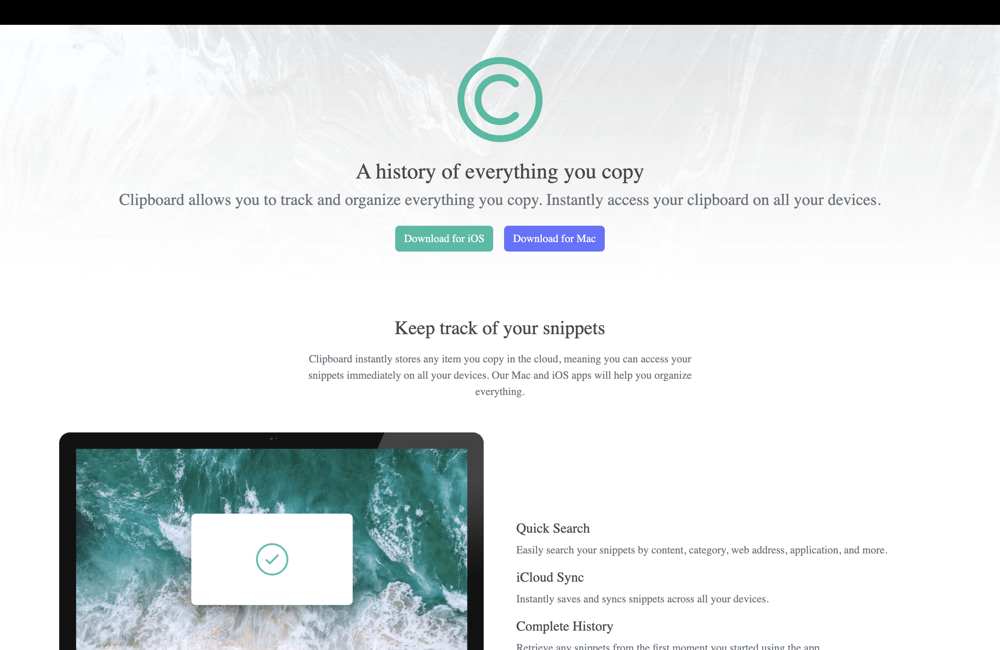
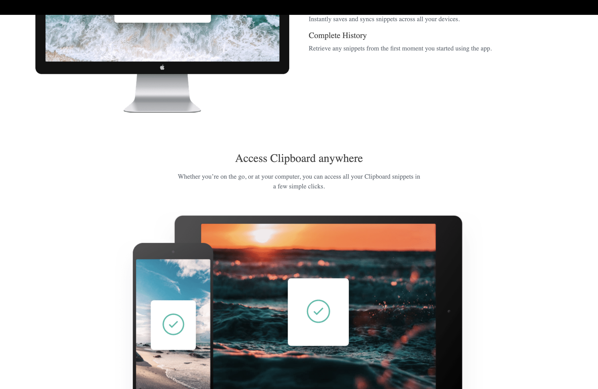
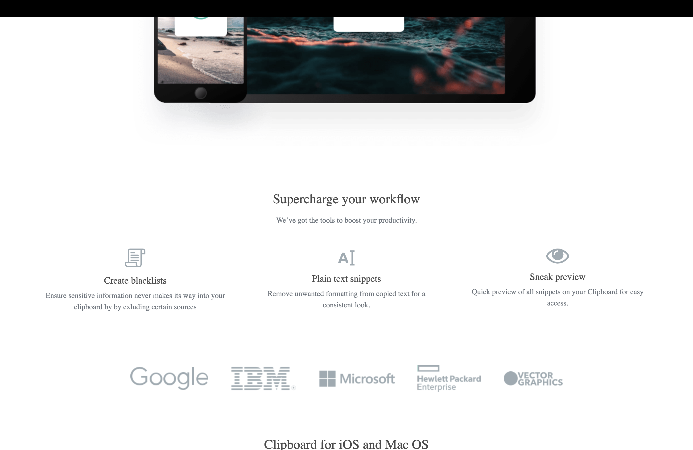
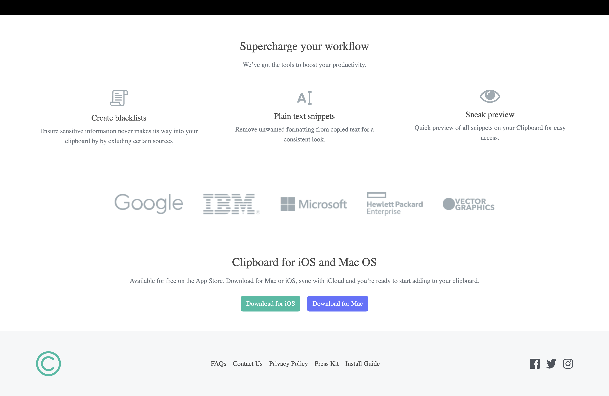

One of the main challenges I faced during this project was getting the layout to match the design across both desktop and mobile screens. I had to find the proper bootstrap documentation that would allow me to align the items the easiest. Through some trial and error and further research I found how Bootstrap's container features help space the grouping more efficiently. The padding and margin also was easy to assign to each section and was still responsive. together for responsiveness. I approached these issues by breaking the layout into smaller sections and testing each change as I went. I found that bootstraps md-row design made it much simpler to lay out rows in mobile designs as well. I also used Bootstrap’s documentation a lot to simplify styling instead of relying on custom CSS. I only used css for background images and certain colors not found within bootstrap. If I had more time, I’d focus on improving alignment consistency, refining spacing, and making the design look more polished overall.

